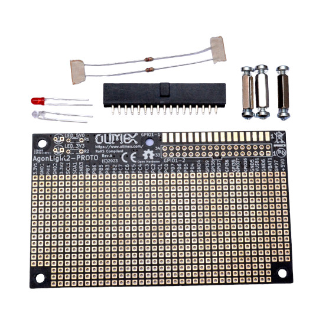

# AgonLight2-Proto

AgonLight2-Proto is small board with dimensions 100x80mm.
It allows you to fast prototype concept and ideas for AgonLight2 computer.

## Features

AgonLight2-Proto has these features:

* IDC connector 34 pin for connection on AgonLight2 GPIO
* 3mm RED LED for 5V power indication
* 3mm GREEN LED for 3.3V power indication
* Sea-of-Pads
* GND and 3.3V bus connecting vertically all pads on the left edge
* GND and 5V bus connecting vertically all pads on the right edge
* Dimensions 100x80mm
* 3 hex distance spacers for keeping board horizontally when ICD connector is plug to AgonLight2 GPIO

## Licenses

* Hardware is released under CERN Open Hardware Licence Version 2 - Strongly Reciprocal, all silkscreen credits to Olimex should remain;
* Software is released under GPL3 Licensee
* Documentation is released under CC BY-SA 3.0